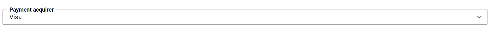

# Settings per payment method

Payment service provider may support several different payment methods. In some cases payment method
supported by payment provider needs additional configuration in order to work correctly. Sana
provides extension developers with possibility to add such functionality via creating additional
class inherited from `PaymentMethodSettings`. All properties specified in this class will be
shown on payment method configuration page.

From this article you will learn how to add payment method settings to payment method configuration
page.

In this developer's guide we are not going to create a new extension, instead of this we will refer
to the payment extension created in [New payment service provider](create-payment-extension.md)
article.

## Add payment method settings

**Step 1**: Create a new class `CustomPayPalPaymentMethodSettings` inherited from
`PaymentMethodSettings`.

```cs
public class CustomPayPalPaymentMethodSettings : PaymentMethodSettings
{
    //Properties
}
```

**Step 2**: Add needed properties to the `CustomPayPalPaymentMethodSettings`.

Let's imagine that our payment method needs to know payment acquirer (such as Visa/Mastercard)
then we can create an `enum` of available acquirers and set it as a type of our `Acquirer`
property.

```cs
public class CustomPayPalPaymentMethodSettings : PaymentMethodSettings
{
    public PaymentAcquirer Acquirer { get; set; }

    public enum PaymentAcquirer
    {
        Visa, 
        Mastercard,
        Other
    }
}
```

**Step 3**: Entity inherited from `PaymentMethodSettings` - is a model that will be rendered on
payment method configuration page, therefore we can use `DataAnnotations` attributes for its
properties. Also there is a possibility to create and use own editor templates.

Let's add `Display` attribute to our property to set more informative field name.

```cs
public class CustomPayPalPaymentMethodSettings : PaymentMethodSettings
{
    [Display(Name = "Payment acquirer")]
    public PaymentAcquirer Acquirer { get; set; }

    public enum PaymentAcquirer
    {
        Visa, 
        Mastercard,
        Other
    }
}
```

**Step 4**: Specify 'CustomPayPalPaymentMethodSettings' as a generic type parameter for
`PaymentExtension` in 'CustomPayPalPaymentExtension.cs'. So it should look like this:

```cs
[PaymentModuleId("PayPal")]
public class CustomPayPalPaymentExtension : PaymentExtension<CustomPayPalPaymentMethodSettings>, IConfigurable<CustomPayPalConfiguration>
{
    // Properties and methods
}
```

**Result**: After these steps we can see the following block with the "Acquirer" input on the
payment method configuration page.



## How to get access to payment method settings

Payment method settings are stored in `MethodSettings` property of
[PaymentContext](../reference/payment-context.md) and
[PaymentStartContext](../reference/payment-start-context.md) parameters that are used in the 
payment extension class, so that you can easily access them like in an example below.

```cs
public override NextAction StartPayment(PaymentStartContext context)
{
    var methodSettings = (CustomPayPalPaymentMethodSettings)context.MethodSettings;
    var paymentMethodAcquirer = methodSettings.Acquirer;

    ...
    // The remaining part of the method was skipped to make an example simpler
}
```

## See also

[Implementing new payment service provider](create-payment-extension.md)

[PaymentContext reference](../reference/payment-context.md)

[PaymentStartContext reference](../reference/payment-start-context.md)