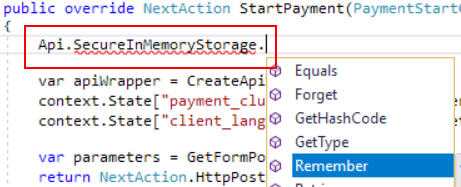

# Storing user's sensitive data

Sometimes an extension may need to keep user's sensitive data across several requests.
For example, a payment extension may ask the user to enter credit card info on one of
checkout steps and then after several request-response round trips this extension may use
this data to send it to payment service provider.

In such case the extension must be compliant with [PCI DSS](https://www.pcisecuritystandards.org/).
Which essentially means that you should not store, transmit or process sensitive authentication
data unless it is really needed, and in case you do, the web store owner will have to pass
assessment procedure as stated per PCI DSS.

That is why we recommend to design your payment extensions in such way that the following
requirements are met. Note that these requirements are provided [as of April, 2018](https://www.pcisecuritystandards.org/documents/PCI_DSS_v3-2.pdf).
Always make sure you check the latest PCI DSS requirements to date.

**Cardholder data**

- Primary Account Number (PAN) _(must be rendered unreadable)_
- Cardholder Name 
- Service Code
- Expiration Date

Cardholder data is allowed to be stored, processed and transmitted in Sana, but make
sure you avoid it as much as possible to lessen the footprint and margin for error.

**Sensitive authentication data**

- Full Track Data
- CAV2/CVC2/CVV2/CID
- PIN/PIN Block

Sensitive authentication data is not allowed to be stored in Sana. So always avoid storing this
data in the SQL database, ERP, file system or Azure storages whatsoever. Also avoid
transferring this data to any 3d party service except PCI DSS compliant payment service
provider or secure storage vault services. Avoid transferring this data between servers in
multi-server Sana Enterprise setup. 

It is only allowed to keep Sensitive authentication data in memory for temporary processing
as long as this data gets removed after card's authorization. To know how to do it in your
extension see further in this article.

## How to store and retrieve sensitive data in extensions

We assume that you're familiar with how [payment extension is created in Sana](create-payment-extension.md).
If not, please make sure you read that article first.

Every extension can use temporary secure in-memory storage provided by [Api.SecureInMemoryStorage](../reference/extension-api-secureinmemorystorage.md)
property. This property already contains a fully initialized instance of the storage and can
be accessed from anywhere in your extension. For example you can use it `StartPayment` method
of the payment extension:



### Storing data

To store sensitive data use `Remember` method:

```cs
Api.SecureInMemoryStorage.Remember("cvv", "123");
```

The data is remembered in server's memory and will be accessible in subsequent requests.
The data will be removed automatically from memory after 20 minutes since adding, it uses
absolute expiration of 20 minutes internally. 

You can specify custom expiration time span:

```cs
// sets 3 minutes of absolute expiration
Api.SecureInMemoryStorage.Remember("cvv", "123", TimeSpan.FromMinutes(3));
```

Internally data is stored as [SecureString](https://msdn.microsoft.com/en-us/library/system.security.securestring(v=vs.110).aspx)
instance in unmanaged memory in encrypted form.

### Retrieving data

To get previously remembered data back use `Retrieve` method:

```cs
string data = Api.SecureInMemoryStorage.Retrieve("cvv");
```

### Removing data

Always remember to remove sensitive authentication data from memory after successful card
authorization. If you forget to do it, Sana will remove the data automatically using expiration
settings provided.

You can remove previously remembered data by calling `Forget` method:

```cs
Api.SecureInMemoryStorage.Forget("cvv");
```

You can also remove the data immediately after retrieving it in case you don't need it anymore:

```cs
string data = Api.SecureInMemoryStorage.RetrieveAndForget("cvv");
```

### Data isolation

Stored data is isolated per each extension instance and per customer type plus customer ID.
So every extension has its own in memory storage and when you remember a new data entry Sana
appends customer's ID and type to the key so that for other customers this value will not be
available by the same key.

## See also

[Extension.Api.SecureInMemoryStorage reference](../reference/extension-api-secureinmemorystorage.md)

[The list of PCI DSS related documentation](https://www.pcisecuritystandards.org/document_library?category=pcidss&document=pci_dss)