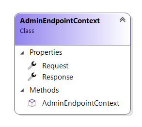

# AdminEndpointContext reference

This article provides reference material about `AdminEndpointContext` class.

`AdminEndpointContext` class provides extension developers with information needed during
admin endpoint execution.

Sana automatically fills in `AdminEndpointContext` parameter with request and response contexts.

## Properties

### Request

The HTTP request.

### Response

The HTTP response.

## See also

[WebstoreEndpointExtension reference](admin-endpoint-extension.md)

