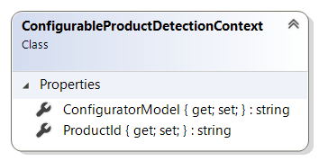

# ConfigurableProductDetectionContext reference

This article provides reference material about `ConfigurableProductDetectionContext` class.

`ConfigurableProductDetectionContext` class provides extension developers with information
needed to detect whether specified product can be configured using current configurator extension.
It is available as a parameter in `DetectConfigurableProductAsync` method of product configurator
extensions.

## Properties

### ConfiguratorModel

Gets or sets the configurator model of the product.
This value comes from the product entity in ERP, stored in a separate field.
Product configurator extension add-on may use this field to identify whether the
product is configurable or not.

### ProductId

Gets or sets the identifier of the product to check.

## See also

[ProductConfiguratorExtension reference](product-configurator-extension.md)