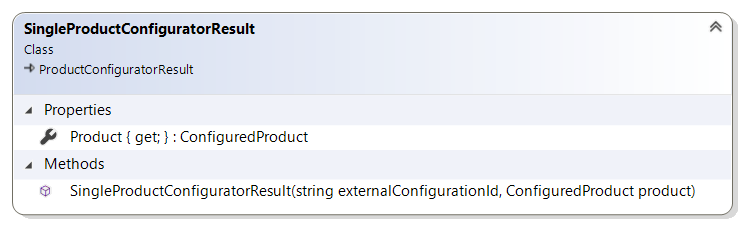

# ProductConfiguratorResult reference

This article provides reference material about `ProductConfiguratorResult` class
and its derived classes.

## ProductConfiguratorResult class

`ProductConfiguratorResult` class is an abstract base class for product configurator result.

[Product configurator extension](product-configurator-extension.md) has to return
an instance of `ProductConfiguratorResult` derived class when Sana calls
`OnConfiguratorClientMessageReceivedAsync` method.

### Properties

#### ExternalConfigurationId

Gets the identifier of product(s) configuration result on configurator service's side.
This is a unique ID of this specific product configuration, done by the user, in external
configurator web site. Sana will use it as a session ID, so that when the user needs to
edit this specific product configuration later in time, Sana will pass this value
in `GetConfiguratorUrlAsync` method of [the extension add-on](product-configurator-extension.md#GetConfiguratorUrlAsync).

## SingleProductConfiguratorResult

`SingleProductConfiguratorResult` class represents the product configurator result
that is used when single product is the actual result of the configuration.

When the user configures a product on configurator web site's side, the result of this
configuration may be a single product (newly created on the fly by the configurator web
site in ERP, or existing product in ERP).

For example, the user starts configuring a product called "T-Shirt" with ID "T_SHIRT".
The external configurator web site is opened in an `iframe` by Sana, and the user
configures the product to their choice in it. When the user is finished with it,
the external configurator web site creates a new product (or picks up existing one) in the
ERP that matches the user's choice, with
"T_SHIRT_COLOR_GREEN_SIZE_XL_PRINT_42" ID and called "Green T-Shirt, Size XL, Print #42".
This product will be the result that needs to be returned to Sana, encapsulated in
`SingleProductConfiguratorResult` instance.

### Properties

#### Product

Gets the instance of [ConfiguredProduct class](configured-product.md) which is the actual result of
the configuration which needs to be added to the basket.

## ProductListConfiguratorResult

`ProductListConfiguratorResult` class represents the product configurator result,
that is used when multiple products are the actual result of the configuration.

> Warning: This scenario is still work in progress, and is not fully supported by Sana
> as of Extension Framework version 1.3.0.

## See also

[ProductConfiguratorExtension reference](product-configurator-extension.md)

[ConfiguredProduct class](configured-product.md)
