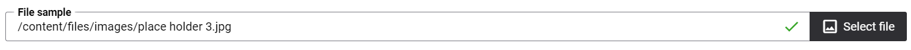
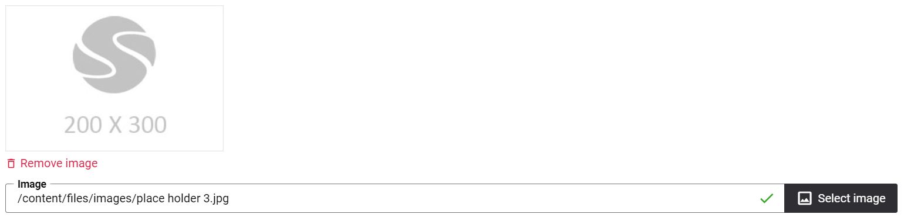
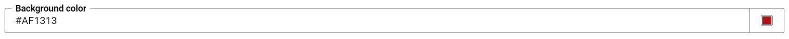
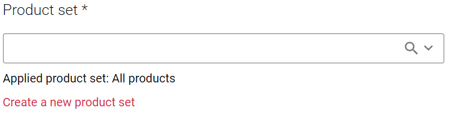
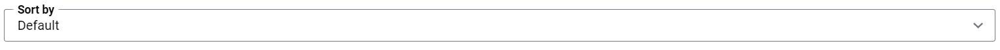
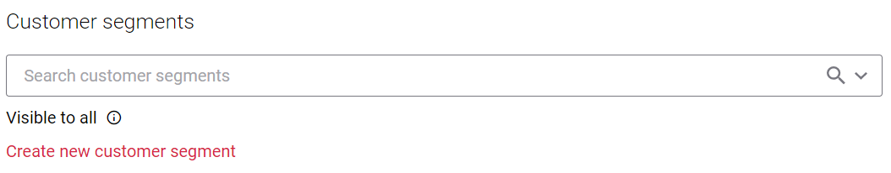

# Sana Admin editors

`SanaAdminEditorAttribute` attribute can be used to specify the editor of property in Sana Admin.
The first parameter of this attribute takes the value of `SanaAdminEditor` enumeration and specifies the editor that will be used for property.

Below you can find the list of editors that are supported:

<a id="on-off"></a>
## SanaAdminEditor.OnOff

Specifies that the property is of boolean type and the OnOff editor should be used.

> [!Note]
> This enum value must be used only for properties that have `bool` or `Boolean` as a type.

```cs
[ConfigurationKey("FedEx")]
public class FedExConfiguration : ExtensionConfiguration
{
    // Other properties

    [Display(Name = "UseDimensions", Order = 10)]
    [SanaAdminEditor(SanaAdminEditor.OnOff)]
    public bool UseDimensions { get; set; }

    // Other properties
}
```


<a id="dropdown-radiobuttons"></a>
## SanaAdminEditor.DropDown, SanaAdminEditor.RadioButtons

Specifies that the property is `enum` and the dropdown (radio buttons group) with all enum values should be used as an editor.

> [!Note]
> This enum value must be used only for properties with `enum` type.

```cs
public class HtmlBlockModel : ContentBlockModel
{
    // Other properties

    [Required]
    [Display(Name = "Vertical alignment")]
    [SanaAdminEditor(SanaAdminEditor.DropDown)]
    public VerticalAlignment VerticalAlignment { get; set; }

    // Other properties
}

public enum VerticalAlignment
{
    Top,
    Center,
    Bottom
}
```

<a id="file-url"></a>
## SanaAdminEditor.FileUrl

Specifies that the property contains path to the file from file manager and
the file selector should be used as an editor.

> [!Note]
> This enum value must be used only for properties with `string` type.

```cs
public class ShoppingCartUploadBlockModel : ContentBlockModel
{
    // Other properties

    [Required]
    [Display(Name = "File sample")]
    [SanaAdminEditor(SanaAdminEditor.FileUrl)]
    public string FileSample { get; set; }

    // Other properties
}
```



<a id="image-url"></a>
## SanaAdminEditor.ImageUrl

Specifies that the property contains path to the image from file manager and
the image selector should be used as an editor.

> [!Note]
> This enum value must be used only for properties with `string` type.

```cs
public class ImageBlockModel : ContentBlockModel
{
    // Other properties

    [Required]
    [Display(Name = "Image")]
    [SanaAdminEditor(SanaAdminEditor.ImageUrl)]
    public string Image { get; set; }

    // Other properties
}
```



<a id="color"></a>
## SanaAdminEditor.Color

Specifies that the property contains a color value and the color selector should be used as an editor.

> [!Note]
> This enum value must be used only for properties with `string` type.

```cs
public class ImageBlockModel : ContentBlockModel
{
    // Other properties

    [Display(Name = "Background color")]
    [SanaAdminEditor(SanaAdminEditor.Color)]
    public string BackgroundColor { get; set; }

    // Other properties
}
```



<a id="country"></a>
## SanaAdminEditor.Country

Specifies that the property contains country code ID and the country code should be used as an editor.

> [!Note]
> This enum value must be used only for properties that have `string` as a type.

```cs
[ConfigurationKey("FedEx")]
public class FedExConfiguration : ExtensionConfiguration
{
    // Other properties

    [Display(Name = "Country", Order = 150)]
    [SanaAdminEditor(SanaAdminEditor.Country)]
    public string ShipperCountryCode { get; set; }

    // Other properties
}
```


<a id="product-set"></a>
## SanaAdminEditor.ProductSet

Specifies that the property contains product set ID and the product set should be used as an editor.

> [!Note]
> This enum value must be used only for properties that have `string` as a type.

```cs
[Serializable]
public class ProductSetContentBlockModel : ContentBlockModel
{
    // Other properties
    
    [Required]
    [Display(Name = "ProductSet")]
    [SanaAdminEditor(SanaAdminEditor.ProductSet)]
    public string ProductSetId { get; set; }

    // Other properties and methods
}
```



<a id="product-sort-option"></a>
## SanaAdminEditor.ProductSortOption

Specifies that the property contains product sort option ID and the product sort option should be used as an editor.

> [!Note]
> This enum value must be used only for properties that have `string` as a type.

```cs
[Serializable]
public class ProductSetContentBlockModel : ContentBlockModel
{
    // Other properties
    
    [Display(Name = "SortBy")]
    [SanaAdminEditor(SanaAdminEditor.ProductSortOption)]
    public string SortOption { get; set; }

    // Other properties and methods
}
```



<a id="customer-segments"></a>
## SanaAdminEditor.CustomerSegments

Specifies that the property contains collection of customer segment IDs and customer segments selector should be used as an editor.

> [!Note]
> This enum value must be used only for properties that have `List<string>` as a type.

```cs
[ConfigurationKey("CustomersConfiguration")]
public class CustomersExportConfiguration : ExtensionConfiguration
{
    // Other properties
    
    [Display(Name = "Customer segments")]
    [SanaAdminEditor(SanaAdminEditor.CustomerSegments)]
    public List<string> CustomerSegmentIds { get; set; }

    // Other properties and methods
}
```

