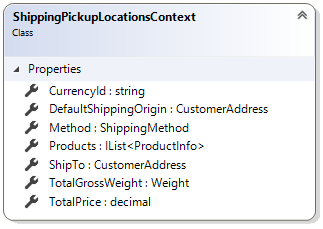

# ShippingPickupLocationsContext

This article provides reference material about `ShippingPickupLocationsContext` class.

`ShippingPickupLocationsContext` class provides extension developers with information needed for returning pickup locations.
Sana automatically fills in `ShippingPickupLocationsContext` parameters before call extension method.

## Properties

### ShipTo

The shipping address of user.

### DefaultShippingOrigin

The shipping origin which is the address of the shipper (the shop owner) to send the shipments from.
This is a default shipping origin which can be used in case specific shipping provider implementation does not provide its
custom shipping origin.

### Method

The shipping method for which the pickup locations should be retrieved.

### Products

The collection of all products that need to be shipped.

### CurrencyId

The currency ID.

### TotalPrice

The total price of all products in the basket including invoice discount and VAT.

### TotalGrossWeight

The total gross weight.

## See also

[Pickup locations](..\how-to\pickup-locations-for-shipping-extension.md)
