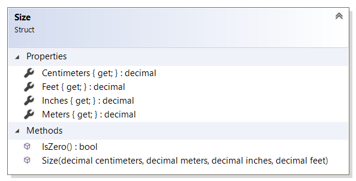

# Size reference

`Size` struct specifies physical size of a product in multiple units of measure.
For example, a product entity has such properties as length, width and height. They
are specified using `Size` structure as data type.

All properties' values are precalculated by Sana so that in extension there is no need to
additionally convert sizes between units of measure. For example, if a product has length of
10 centimeters, then Sana will precalculate the size values in all these units of measure:

* `Centimeters` will be `10`;
* `Meters` will be `0.1`;
* `Feet` will be `0.32808399`;
* `Inches` will be `3.93700787`.

Note that the values are not rounded up or down. Rounding, if needed, should be done
in the extension.

## Properties

### Centimeters

Gets the size value in centimeters.

### Meters

Gets the same size value in meters.

### Feet

Gets the same size value in feet.

### Inches

Gets the same size value in inches.

### IsZero

Checks whether the size is zero.
Returns `true` if at least one of units of measure has zero value; 
`false` if all units of measure contain non-zero value.

## See also

[ProductInfo reference](product-info.md)