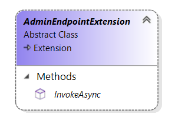

# AdminEndpointExtension reference

`Sana.Extensions.Http.AdminEndpointExtension` is an abstract class that allows a developer to handle random HTTP requests in Sana Commerce. It works similar to HTTP middleware in .NET.

The addon can process the URL with the following pattern: `/admin/api/addon/{AddonId}/{*endpoint-specific-path}` where:
- `/admin/api/addon` is a constant value,
- `/{AddonId}` is an addon identifier from `sanamanifest.xml` file,
- the rest of URL will be passed to `AdminEndpointContext.Request.Path` property to be handled in `InvokeAsync` method.

For example, we have the addon with identifier "TestPaymentModules" and want to handle URL "/test". So, the final URL will be `/admin/api/addon/TestPaymentModules/test`.



## Methods

<a id="InvokeAsync"></a>
### InvokeAsync

The `InvokeAsync` method is responsible for handling an HTTP request and providing an HTTP response.

This method takes the following arguments:
- `context` - an instance of [AdminEndpointContext](admin-endpoint-context.md)
with HTTP related information;
- `next` - contains the link to the `InvokeAsync` method of the next endpoint extension;
- `cancellationToken` - an HTTP request cancellation token.

Sana calls the `InvokeAsync` method for each `AdminEndpointExtension` in addon one by one. 
The endpoint extension can delegate request processing to the next handler available in the `next` argument.
If no endpoint can handle the request, then Sana will return a 404 status code with an empty response. 

The method is called by Sana asynchronously, so you may use `async/await` here in case
you need to access any external resources in an asynchronous way.

Example:

```cs
public override Task InvokeAsync(AdminEndpointContext context, Func<Task> next, CancellationToken cancellationToken)
{
    if (context.Request.Path.StartsWith("/test"))
    {
        return context.Response.WriteAsync("ok", cancellationToken);
    }

    // Call the next endpoint/delegate in the pipeline
    return next();
}
```

## See also

[Create admin endpoint extension](https://community.sana-commerce.com/docs/SCC_Guides/Extensions/how-to//create-admin-endpoint-extension.md)

[AdminEndpointContext reference](admin-endpoint-context.md)
