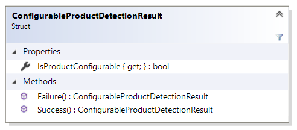

# ConfigurableProductDetectionResult reference

This article provides reference material about `ConfigurableProductDetectionResult` struct.

`ConfigurableProductDetectionResult` struct represents the result of detecting whether
a product is configurable or not.

[Product configurator extension](product-configurator-extension.md) has to return instance of
the `ConfigurableProductDetectionResult` as a result of the `DetectConfigurableProductAsync`
method.



## Properties

### IsProductConfigurable

Gets the value indicating whether the product is configurable or not.

## Methods

### Success

Static method that creates a new instance of `ConfigurableProductDetectionResult` struct indicating that
the product was indeed detected as configurable. This method initializes `IsProductConfigurable`
property with `true` value.

Example:

```cs
return ConfigurableProductDetectionResult.Success();
```

### Failure

Static method that creates a new instance of `ConfigurableProductDetectionResult` struct indicating that
the product was not detected as configurable. This method initializes `IsProductConfigurable`
property with `false` value.

Example:

```cs
return ConfigurableProductDetectionResult.Failure();
```

## See also

[ProductConfiguratorExtension reference](product-configurator-extension.md)