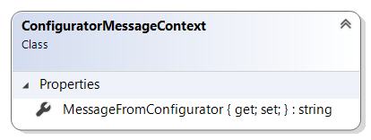

# ConfiguratorMessageContext reference

This article provides reference material about `ConfiguratorMessageContext` class.

`ConfiguratorMessageContext` class is used to pass context object to product configurator
extension when handling a message coming from product configurator service. It is available
as a parameter in `OnConfiguratorClientMessageReceivedAsync` method of product
configurator extensions.

## Properties

### MessageFromConfigurator

Gets or sets the message passed from the product configurator service to Sana.
This message is provided by the external product configurator web site and
is not modified by Sana in any way. Sana simply passes this message from the external
configurator web site "as is" to the product configurator extension add-on to
decode it. The message may be anything in text form: a text string, a Json object, etc.

## See also

[ProductConfiguratorExtension reference](product-configurator-extension.md)

