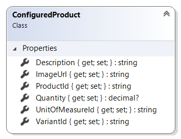

# ConfiguredProduct reference

This article provides reference material about `ConfiguredProduct` class.

`ConfiguredProduct` class represents the product that has been selected as result of
configuration done by a user using product configurator.

## Properties

### Description

Gets or sets the user-friendly text of description of the specific configuration result.

### ImageUrl

Gets or sets the URL of image of the product which represents the specific configuration
result. This is an external URL provided by the configurator service.

### ProductId

Gets or sets the identifier of the product which represents the specific configuration result.

### Quantity

Gets or sets the quanity of the product which represents the specific configuration result
as selected by user to add to the basket. Can be `null` in case the configurator does not
provide quantity.

### UnitOfMeasureId

Gets or sets the unit of measure of the product which represents the specific configuration
result.

### VariantId

Gets or sets the identifier of the product variant which represents the specific configuration
result.

## See also

[ProductConfiguratorResult reference](product-configurator-result.md)