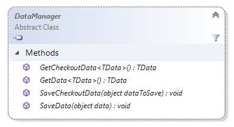

# Extension.Api.Data reference

Every extension in Sana has access to data retrieval functionality via its `Api.Data`
property. This property holds an instance of `DataManager` type which serves as an entry 
point to save or retrieve any generic data that the extension needs to store in Sana. 

The data is persisted in SQL database and can be accessible throughout multiple 
requests and on all server instances in multi-server setup.

## Data isolation

The data is isolated per extension and per customer ID. This means that the data you save 
will be accessible only when the same customer browses the web store and in scope of the
same extension.

> [!Important]
> Anonymous users share the same customer ID - the customer which is configured in ERP as
> template for anonymous users. This means that for all anonymous users the same data will
> be accessible.

## Methods



### SaveData

Saves data in SQL database for current user. This data is saved permanently and will be 
available on each request. The data which is saved can be any primitive or complex type 
— internally `SanaObjectSerializer` is used to serialize the data before saving it.

```cs
// saving primitive type data
string data = "some data";
Api.Data.SaveData(data);
```

```cs
// saving complex type data
var data = new Dictionary<string, string>
{
    { "key 1", "value 1" },
    { "key 2", "value 2" }
};
Api.Data.SaveData(data);
```

### GetData

Gets data previously saved per current user from SQL database.

```cs
// generic type parameter is used to cast the resulting data object to
var data = Api.Data.GetData<string>();
```

### SaveCheckoutData

Saves data for current checkout process. Technically, the data is saved in current basket
record in SQL database. This data will be removed as soon as checkout is finished and 
basket is cleared automatically. The data which is saved can be any primitive or complex type.

> [!Important]
> If this method is called during invoice payment or offline order payment process,
> the data will be stored only in memory during actual request lifecycle and will become 
> removed when the request is finished.
> 

```cs
string data = "some data";
Api.Data.SaveCheckoutData(data);
```

### GetCheckoutData

Gets data previously saved for current checkout process.

```cs
// generic type parameter is used to cast the resulting data object to
var data = Api.Data.GetCheckoutData<string>();
```

## See also

[Extension.Api reference](extension-api.md)