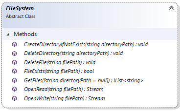

# Extension.Api.DataFiles reference

This article provides reference material about extension file system API. Every extension has
[`Api` property](extension-api.md) which contains `DataFiles` property which provides extension
developer with possibility to use file system from within extension.

File system API uses isolated storage. Isolated storage is a separate folder for each extension
where extensions can save data. Each extension has access only to its folder. All isolated
storage folders are located in 
"/**application_folder**/@data/packages-data".

## Methods



### CreateDirectoryIfNotExists

Creates the directory if it does not exist in the extension's file storage yet.

```cs
Api.DataFiles.CreateDirectoryIfNotExists("new-folder");
```

### DeleteDirectory

Deletes the directory from the extension's file storage.

```cs
Api.DataFiles.DeleteDirectory("folder-to-delete");
```

### DeleteFile

Deletes the specified file from the extension's file storage.

```cs
Api.DataFiles.DeleteFile("file.txt");
```

### FileExists

Returns the boolean value whether the file exists in the extension's file storage or not.

```cs
bool fileExists = Api.DataFiles.FileExists("file.txt");
```

### GetFiles

Returns the list of file names from the extension's file storage by specified `fileName` parameter.

For example, if `fileName` equals "file" then this method will return all files with
such name("file.txt", "file.doc", etc.).

```
var files = Api.DataFiles.GetFiles("file");
```

### OpenRead

Opens an existing file from the extension's file storage for reading.
Returns `Stream`.

```cs
using (var stream = Api.DataFiles.OpenRead("file.txt"))
{
    string data;
    using (var sr = new StreamReader(stream))
        data = sr.ReadToEnd();
}
```

### OpenWrite

Opens an existing file from the extension's file storage or creates a new file for writing.
Returns `Stream`.

If your file already contains data that you don't need anymore
then you can delete it and open for writing again.

```cs
Api.DataFiles.DeleteFile("file.txt");

using (var stream = Api.DataFiles.OpenWrite("file.txt"))
{
    using (var sw = new StreamWriter(stream))
        sw.Write("Hello world!");
}
```

If your file already contains data and you want to append data to it
then you can use the following code example that sets the position of the stream
to the end of file before writing to it.

```cs
using (var stream = Api.DataFiles.OpenWrite("file.txt"))
{
    stream.Seek(0, SeekOrigin.End); // sets the current position of this stream to to the end of the file

    using (var sw = new StreamWriter(stream))
        sw.Write("Hello world!");
}
```

## See also

[Extension.Api reference](extension-api.md)