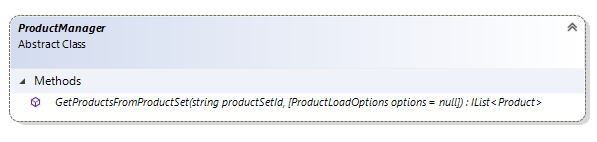

# Extension.Api.Products reference

Every extension in Sana has access to product retrieval functionality via its `Api.Products`. This property holds an instance of `ProductManager` type which serves as an entry 
point to retrieve products. 

## Methods



### GetProductsByProductSet(string productSetId, ProductLoadOptions options = null)

Gets products by specified product set.

The instance of `ProductLoadOptions` can be used as second parameter to define additional load options.
For more information, see [ProductLoadOptions](#ProductLoadOptions).

The `UIHint("ProductSet")` is using to set product set ID.
For more information, see [Sana Admin editors - ProductSet](sana-admin-editors.md#product-set).

```cs
var loadOptions = new ProductLoadOptions();
loadOptions.PageSize = contentBlock.MaximumProductsToShow;
// Other code
contentBlock.Products = Api.Products.GetProductsByProductSet(contentBlock.ProductSetId, loadOptions);
```

<a id="ProductLoadOptions"></a>
## ProductLoadOptions

The `ProductLoadOptions` class represents the parameters that are used to load products.

```cs
var loadOptions = new ProductLoadOptions();
loadOptions.PageSize = contentBlock.MaximumProductsToShow;
loadOptions.SortOption = contentBlock.SortOption;
contentBlock.Products = Api.Products.GetProductsByProductSet(contentBlock.ProductSetId, loadOptions);
```

### Parameters

#### PageIndex

The zero-based index of the page to retrieve.

```cs
var loadOptions = new ProductLoadOptions();
loadOptions.PageIndex = 0;
// Other code
contentBlock.Products = Api.Products.GetProductsByProductSet(contentBlock.ProductSetId, loadOptions);
```

#### PageSize

Amount of products to retrieve. Default value of this property is 10.

```cs
var loadOptions = new ProductLoadOptions();
loadOptions.PageSize = 10;
// Other code
contentBlock.Products = Api.Products.GetProductsByProductSet(contentBlock.ProductSetId, loadOptions);
```

#### SortOption

The sort option ID to sort the result on. It can be empty: in such case the default product sorting will be applied.

The `UIHint("ProductSortOption")` is using to set product sort option ID.
For more information, see [Sana Admin editors - ProductSortOption](sana-admin-editors.md#product-sort-option).

```cs
var loadOptions = new ProductLoadOptions();
loadOptions.SortOption = contentBlock.SortOption;
// Other code
contentBlock.Products = Api.Products.GetProductsByProductSet(contentBlock.ProductSetId, loadOptions);
```

## See also

- [Extension.Api reference](extension-api.md)
- [Sana Admin editors - ProductSet](sana-admin-editors.md#product-set)
- [Sana Admin editors - ProductSortOption](sana-admin-editors.md#product-sort-option)
