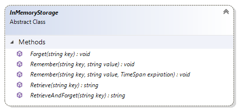

# Extension.Api.SecureInMemoryStorage reference

This article provides reference material about secure temporary in-memory storage API.
Every extension has [`Api` property](extension-api.md) which contains `SecureInMemoryStorage`
property which provides the way to store user's sensitive authentication data for short period
of time with possibility to access this data later in subsequent requests.

The `SecureInMemoryStorage` property holds an instance of `InMemoryStorage` type. See the
[How to store sensitive data tutorial](../how-to/store-sensitive-data.md) to learn how
to use this API.

## Methods



### Remember(string, string)

Remembers the value and stores it in memory for limited amount of time, which is 20 minutes 
of absolute expiration by default. The data will then be available during subsequent requests
until the expiration time ends.

```cs
Api.SecureInMemoryStorage.Remember("cvv", "123");
```

### Remember(string, string, TimeSpan)

Remembers the value and stores it in memory for specified amount of time. The data will then
be available during subsequent requests until specified expiration time ends.

```cs
Api.SecureInMemoryStorage.Remember("cvv", "123", TimeSpan.FromMinutes(3));
```

### Retrieve

Retrieves the value stored in memory.

```cs
string data = Api.SecureInMemoryStorage.Retrieve("cvv");
```

### Forget

Removes the value from memory.

```cs
Api.SecureInMemoryStorage.Forget("cvv");
```

### RetrieveAndForget

Retrieves the value stored in memory and removes it immediately. Use this method if you do not
need to access the stored value later and do not wish to call `Forget` later to remove it.

```cs
string data = Api.SecureInMemoryStorage.RetrieveAndForget("cvv");
```

## See also

[How to store sensitive data tutorial](../how-to/store-sensitive-data.md)