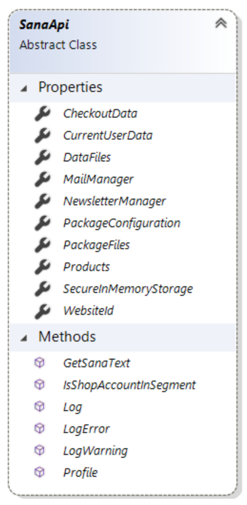

# Extension.Api reference

Every extension is created as a class inherited from one of the base extension classes.
In turn, every base extension class inherits from `Extension` abstract class.

For example, core Sana payment extension, which encapsulates Docdata payment service
provider, is implemented in `DocdataPaymentExtension` class, which is inherited from 
`PaymentExtension` which, in turn, inherits from `Extension` class.


`Extension` abstract class provides `Api` property which holds the instance of `SanaApi`
type and which is the entry point to core Sana Commerce Framework functionality:

```cs
public abstract class Extension
{
    public SanaApi Api { get; internal set; }

    ...
}
```

`Api` provides access to functionality such as reading or writing files, logging errors, 
getting Sana texts and messages, etc.

## Properties



### Data

Gets the instance of the `DataManager` type. Provides access to storing and retrieving
various data, which is kept in SQL database, from within extension.

See [Extension.Api.Data reference](extension-api-data.md).

```cs
Api.Data.SaveData("some data");
```

### DataFiles

Gets the instance of the `DataFiles` type. Provides access to reading and writing files
to extension's isolated file storage.

See [Extension.Api.DataFiles reference](extension-api-datafiles.md).

```cs
using (var file = Api.DataFiles.OpenRead("somefile.txt"))
{
    ...
}
```

### Products

Gets the instance of the `ProductManager` type. Provides product retrieving functionality.

See [Extension.Api.Products reference](extension-api-products.md).

```cs
protected override void Initialize(ProductSetContentBlockModel contentBlock)
{
    var loadOptions = new ProductLoadOptions();
    loadOptions.PageSize = contentBlock.MaximumProductsToShow;
    loadOptions.SortOption = contentBlock.SortOption;
    contentBlock.Products = Api.Products.GetProductsByProductSet(contentBlock.ProductSetId, loadOptions);
}
```

### WebsiteId

Gets the identifier of current web store being browsed by the user during current HTTP request.

```cs
string currentWebsiteId = Api.WebsiteId;
```

### NewsletterManager

Gets the instance of the `NewsletterManager` type. Provides newsletter retrieving functionality.

See [Extension.Api.NewsletterManager reference](extension-api-newsletter.md).

```cs
Api.NewsletterManager.Subscribe("some@sana-commerce.com");
```

### PackageConfiguration

Gets the the package configuration from the appsettings file.

```cs
//Get configuration
var config = Api.PackageConfiguration;

//Read configuration by key 
string value = "";
config.TryGetValue("SomeKey", out value);
```

### MailManager

Gets the instance of the `MailManager` type. Provides mail sending functionality.

See [Extension.Api.MailManager reference](extension-api-mail.md).

```cs
var replacementTags = new NameValueCollection();
replacementTags.Add("LINK", "example.com");
Api.MailManager.SendEmail(new List<string>() { some@sana-commerce.com }, "FollowEmail", replacementTags);
```

## Methods

### GetSanaText

Gets Sana text which can be used as a message on user interface for example.

```cs
var msg = Api.GetSanaText("CustomTextKey", "This is a default text for this message");
```

### Log

Writes informational message to the log file.

```cs
Api.Log("Some informational message");
```

### LogError

Writes error message to the log file.

```cs
Api.LogError("An error has just occurred.");
```

> [!Important]
> Never write customer's personal data to log files. Names, addresses, phone numbers, etc. must
> never be written to log files. Also never write payment sensitive data, e.g. payment card
> data, to log files.

### IsShopAccountInSegment

Checks whether account belongs to the specified customer segment.

```cs
Api.IsShopAccountInSegment(customerSegmentId, shopAccount);
```

### Profile

Creates new performance profiling step for performance profiler that can be shown on 
frontend pages.

```cs
using (var step = Api.Profile("Profiling extension."))
{
    // profiled code goes here
}
```

## See also

[Extension.Api.Data reference](extension-api-data.md).

[Extension.Api.DataFiles reference](extension-api-datafiles.md)