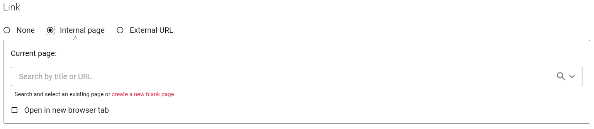

# Link class

Sana Extensions framework provides `Sana.Extensions.Models.Types.Link` class which represents internal or external link.
It can be used in content block model, settings class, etc.

## Add link to your model

If you need to add a link to your model, just add a property with `Sana.Extensions.Models.Types.Link` type:
```cs
public Link Link { get; set; }
```

Sana will automatically render standard link editor for this property in Sana Admin,
so user can select internal page or enter URL to external resource using standard interface:



## Link properties

`Link` class has only one public property `Target` which contains value for 'target' attribute in HTML.
This property is assigned by link editor in Sana admin.

Other properties are protected because they contain link data in internal format and they should not be used by extension developer directly.

## Link rendering on webstore

`Link` data will be converted to JSON object and passed to add-on React component. `Link` component should be used for rendering.

Example:
```js
import { Link } from 'sana/elements';

const Component = ({ model }) => {
  const link = model.link;

  return (
    <Link to={link.to} url={link.url} target={link.target}>Link title</Link>
  );
};
```

## See also

[How to create a content block extension](https://community.sana-commerce.com/docs/SCC_Guides/Extensions/how-to/create-content-block-extension.html)

[Extension configuration](https://community.sana-commerce.com/docs/SCC_Guides/Extensions/how-to/extension-configuration.html)