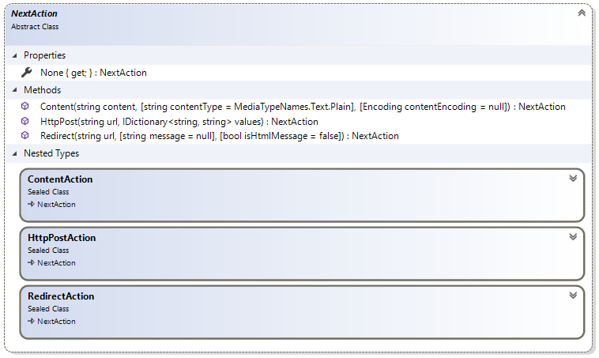

# NextAction reference

Determines the next action that needs to be executed by Sana after payment extension completes
certain step. For example an instance of this type should be returned by payment extension's
`StartPayment` or `ProcessCallback` methods to indicate what Sana needs to do after these
methods are complete.



## NextAction.None

Tells Sana that no particular action needs to be executed. Returns `null`.

For example, let's assume we have a payment extension and its `ProcessCallback` method implemented.
Let's say our payment service provider will at some point do a callback to Sana and expects only an
HTTP 200 status response from it. In such case we need to implement `ProcessCallback` method in such
way that it returns `NextAction.None` to indicate to Sana that nothing else needs to be done and that
the request can be finished:

```cs
public override NextAction ProcessCallback(PaymentContext context)
{
    // We assume that here we have some implemented logic of the callback processing.
    ...

    // In the end by returning NextAction.None we tell Sana to do nothing
    // so that the request just ends and HTTP 200 status is returned to the payment service.
    return NextAction.None;
}
```

## NextAction.HttpPost

Tells Sana to send an HTTP POST request to specified URL with specified form values.
Returns an instance of `NextAction.HttpPostAction` nested type.

It can be used in `StartPayment` method of the payment extension to post the data to the
payment service provider:

```cs
public override NextAction StartPayment(PaymentStartContext context)
{
    // valuesToPost is the dictionary containing the values to post to the payment service provider.
    var valuesToPost = new Dictionary<string, string>
    {
        { "id", context.TransactionId }
    };
    ...

    // paymentUrl here is the URL of the payment service provider's page.
    return NextAction.HttpPost(paymentUrl, valuesToPost);
}
```

## NextAction.Redirect

Tells Sana to perform a redirect to specified URL. Returns an instance of `NextAction.RedirectAction`
nested type.

It can be used in `StartPayment` method of the payment extension to redirect the user to
the payment service provider's page:

```cs
public override NextAction StartPayment(PaymentStartContext context)
{
    ...

    // paymentUrl here is the URL of the payment service provider's page.
    return NextAction.Redirect(paymentUrl);
}
```

You can specify an optional message that will be shown to the user while the redirect is being
performed in the user's browser:

```cs
return NextAction.Redirect(paymentUrl, "Please wait while we are redirecting you to the payment service provider page...");
```

The message can be also a piece of HTML markup if you need to beautify it with some formatting.
To do this pass `true` as `isHtmlMessage` parameter:

```cs
string formattedMessage = "<h1>Redirecting...<h1><div>Please wait while we are redirecting you to the payment service provider page...<div>";
return NextAction.Redirect(paymentUrl, formattedMessage, isHtmlMessage: true);
```

## NextAction.Content

Tells Sana to respond to the request with custom content provided by the extension.
Returns an instance of `NextAction.ContentResponseAction` nested type.

It can be used in `ProcessCallback` method of the payment extension to respond to the callback using format required by the PSP.

Let's say our payment service provider will at some point do a callback to Sana and expect 'Success' response string in UTF-8 encoding with HTTP 200 status from it:

```cs
public override NextAction ProcessCallback(PaymentContext context)
{
    // We assume that here we have some implemented logic of the callback processing
    // (e.g. payment status is retrieved from `context.HttpContext` and passed to `context.State.PaymentStatus`).
    ...

    // By returning NextAction.Content we tell Sana to write plain "Success" string in UTF8 encoding to the response body.
    return NextAction.Content("Success", contentEncoding: Encoding.UTF8);
}
```

## See also

[New payment service provider](https://community.sana-commerce.com/docs/SCC_Guides/Extensions/how-to//create-payment-extension.md)