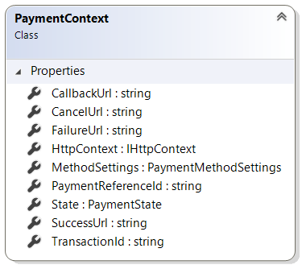

# PaymentContext reference

This article provides reference material about `PaymentContext` class.

`PaymentContext` class provides extension developers with information needed during payment
process. It is available as a parameter in `FinalizePayment` and `ProcessCallback` methods
of payment extensions.

Sana automatically fills in `PaymentContext` parameter of `FinalizePayment` and
`ProcessCallback` methods with data from order, transaction, shop context, etc.

## Properties

Note, only `PaymentReferenceId` property can be set from extensions.



### CallbackUrl

Gets order payment callback URL. This URL is used by payment service provider to perform
callback to the web store to update payment status of the order to actual payment status.
Typically this callback is performed when payment service provider finally gets payment
transaction confirmed by a bank.

Sana automatically generates callback URL, it looks like
_`"https://[your_website.com]/en-us/confirm/payment/[TransactionId]"`_. You should send this
URL to the payment service provider request, so that it knows where to make a call to update the
payment status.

When payment service provider makes a call to Sana by URL specified in this property
`ProcessCallback` method of payment extension will be triggered.

```cs

public override NextAction StartPayment(PaymentStartContext context)
{
    var parameters = GetFormPostParameters(context);

    return NextAction.HttpPost(GetPaymentPageUrl(context), parameters);
}

IDictionary<string, string> GetFormPostParameters(PaymentStartContext context)
{
    return new Dictionary<string, string>(StringComparer.OrdinalIgnoreCase)
    {
        ["callback_url"] = context.CallbackUrl,

        // Other parameters
    };
}
```

### CancelUrl

Gets order payment cancelled URL. If payment has been cancelled the user gets redirected
to the URL specified in this property.

Sana automatically generates cancel URL, it looks like
_`"https://[your_website.com]/en-us/checkout/ordercancelled/[TransactionId]"`_. You should send this
URL to the payment service provider request, so that it knows where to redirect user if payment
is cancelled.

When payment service provider makes a call to Sana by URL specified in this property
`FinalizeOrder` method of payment extension will be triggered.

```cs

public override NextAction StartPayment(PaymentStartContext context)
{
    var parameters = GetFormPostParameters(context);

    return NextAction.HttpPost(GetPaymentPageUrl(context), parameters);
}

IDictionary<string, string> GetFormPostParameters(PaymentStartContext context)
{
    return new Dictionary<string, string>(StringComparer.OrdinalIgnoreCase)
    {
        ["cancel_url"] = context.CancelUrl,

        // Other parameters
    };
}
```

### FailureUrl

Gets order payment failed URL. If payment has been failed the user gets redirected to the
URL specified in this property.

Sana automatically generates failure URL, it looks like
_`"https://[your_website.com]/en-us/checkout/orderfailed/[TransactionId]"`_. You should send this
URL to the payment service provider request, so that it knows where to redirect user if payment
is failed.

When payment service provider makes a call to Sana by URL specified in this property
`FinalizeOrder` method of payment extension will be triggered.

```cs

public override NextAction StartPayment(PaymentStartContext context)
{
    var parameters = GetFormPostParameters(context);

    return NextAction.HttpPost(GetPaymentPageUrl(context), parameters);
}

IDictionary<string, string> GetFormPostParameters(PaymentStartContext context)
{
    return new Dictionary<string, string>(StringComparer.OrdinalIgnoreCase)
    {
        ["failure_url"] = context.FailureUrl,

        // Other parameters
    };
}
```

### HttpContext

Gets the HTTP context. It contains information about current HTTP request.

```cs
var transactionId = context.HttpContext.Request.Form["x_trans_id"];
```

### MethodSettings

Gets settings of current payment method. This property contains settings of current
payment method. If no settings exist for current payment method, then `null` is returned.
More information about payment method settings you can find in
[Settings per payment method](https://community.sana-commerce.com/docs/SCC_Guides/Extensions/how-to/payment-method-settings.html) article.

```cs
var methodSettings = (CustomPayPalPaymentMethodSettings)context.MethodSettings;
var paymentMethodAcquirer = methodSettings.Acquirer;
```

### PaymentReferenceId

Gets or sets payment reference identifier.

Some payment service providers ignore payment identifiers generated by Sana, instead of this they
generate their own identifiers. In such case we should save this identifier to `PaymentReferenceId`
property and use it later to communicate with payment service provider.

```cs
context.PaymentReferenceId = context.HttpContext.Request.Form["psp_transaction_id"];
```

### State

Gets payment state which is maintained between different payment steps. For example, you
can save payment service provider access token received in `StartPayment` method and use it
later in `Finalize` method.

```cs
public override NextAction StartPayment(PaymentStartContext context)
{
    var token = GetToken(context);
    context.State["token"] = token;
}

string GetToken(PaymentStartContext context)
{
    // Returns payment service provider access token
}

public override NextAction FinalizePayment(PaymentContext context)
{
    var token = context.State["token"];

    ...
    // The remaining part of the method was skipped to make an example simpler
}
```

### SuccessUrl

Gets order payment success URL. If payment has succeeded the user gets redirected to the
URL specified in this property.

Sana automatically generates success URL, it looks like
_`"https://[your_website.com]/en-us/checkout/ordersubmit/[TransactionId]"`_. You should send this
URL to the payment service provider request, so that it knows where to redirect user if payment
is successful.

When payment service provider makes a call to Sana by URL specified in this property
`FinalizeOrder` method of payment extension will be triggered.

```cs

public override NextAction StartPayment(PaymentStartContext context)
{
    var parameters = GetFormPostParameters(context);

    return NextAction.HttpPost(GetPaymentPageUrl(context), parameters);
}

IDictionary<string, string> GetFormPostParameters(PaymentStartContext context)
{
    return new Dictionary<string, string>(StringComparer.OrdinalIgnoreCase)
    {
        ["success_url"] = context.SuccessUrl,

        // Other parameters
    };
}
```

### TransactionId

Gets unique payment transaction identifier generated by Sana.

```cs
// Assuming that PspWebService is your instance of PSP gateway service
var updatedStatus = PspWebService.GetPaymentStatus(context.TransactionId);
```

## See also

[PaymentStartContext reference](payment-start-context.md)

[New payment service provider](https://community.sana-commerce.com/docs/SCC_Guides/Extensions/how-to/create-payment-extension.html)

[Settings per payment method](https://community.sana-commerce.com/docs/SCC_Guides/Extensions/how-to/payment-method-settings.html)