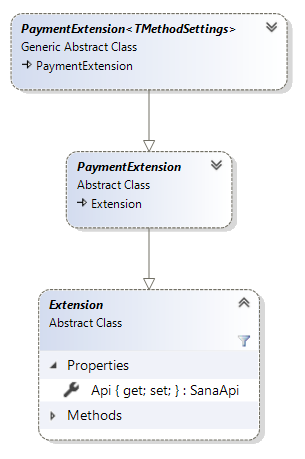
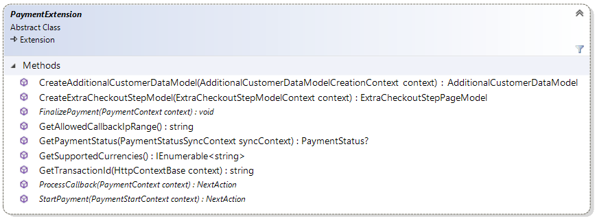

# PaymentExtension reference

This article provides reference material about `PaymentExtension` class. All payment extensions
have to be inherited from the `PaymentExtension` which, in turn, inherits from the core
Sana `Extension` class.

There is also generic class `PaymentExtension<TMethodSettings>` inherited from
`PaymentExtension` which provides payment extensions with possibility to have configurable
payment methods. It takes type inherited from `PaymentMethodSettings` as a generic type
parameter. More details about payment method settings you can find in 
[Settings per payment method](https://community.sana-commerce.com/docs/SCC_Guides/Extensions/how-to//payment-method-settings.md) article.



## Methods



### CreateAdditionalCustomerDataModel

Returns an instance of `AdditionalCustomerDataModel` that will be used as a view model for
"Information for payment provider" checkout step. In base implementation returns `null`.

For example, when payment provider needs additional customer data, extension developer has to create
class inherited from `AdditionalCustomerDataModel`. Instance of this class has to be returned by
`CreateAdditionalCustomerDataModel` method to inform Sana to render it as a view model for
"Information for payment provider" checkout step.

More information about additional customer data model you can find in
[Additional information for payment method during checkout](https://community.sana-commerce.com/docs/SCC_Guides/Extensions/how-to//additional-customer-data-model.md)
article.

```cs
public override AdditionalCustomerDataModel CreateAdditionalCustomerDataModel(AdditionalCustomerDataModelCreationContext context)
{
    // Assuming that 'MyCustomerDataModel' is the model that needs to be
    // rendered on "Information for payment provider" checkout step
    return new MyCustomerDataModel();
}
```

### CreateExtraCheckoutStepModel

Returns an instance of `ExtraCheckoutStepPageModel` that will be used as an extra checkout step.
In base implementation returns `null`.

```cs
public override ExtraCheckoutStepPageModel CreateExtraCheckoutStepModel(ExtraCheckoutStepModelContext context)
{
    // Assuming that 'ExtraStepModel' is extra checkout step model
    // that needs to be inserted to the current checkout process
    return new ExtraStepModel(Api);
}
```

### FinalizePayment

This method is called when the user is done with the payment on the PSP payment page.
Sana calls `Finalize` method to finalize the current payment process. Finalizing means
that the current payment status of the order will be updated to the actual status from PSP
and the payment transaction will be set as finalized so that we do not start it again accidentally.

```cs
public override void FinalizePayment(PaymentContext context)
{
    var result = context.HttpContext.Request.Form["RESULT"];
    if (result == "0")
        context.State.PaymentStatus = PaymentStatus.Paid;
    else
        context.State.PaymentStatus = PaymentStatus.Cancelled;
}
```

### GetAllowedCallbackIpRange

Returns the IPv4 address filter where payment callbacks are allowed from. This method is
called by Sana before processing payment callback request. If origin IP address of the
payment callback request is in the list of allowed IP address ranges then Sana will continue
execution flow, otherwise request will be blocked and corresponding exception will be thrown.

The filter can be in format of a single IP address (127.0.0.1), an address range
(127.0.0.1-127.0.0.256) or an address mask (127.0.\*.\*). Multiple allowed filters can be combined
with a vertical pipe character '|'.

```cs
public override string GetAllowedCallbackIpRange()
{
    // Assuming that IP range has been entered on configuration page in Sana Admin
    return Configuration?.IpRange;
}
```

### GetSupportedCurrencies

Gets the list of all currencies identifiers supported by the current payment provider according
to the [ISO 4217](https://en.wikipedia.org/wiki/ISO_4217) standard. In base implementation returns
a single item with the value "*" means that all currencies are supported.

In case when payment provider does not support all currencies, extension developer has possibility
to override this method.

```cs
public override IEnumerable<string> GetSupportedCurrencies()
{
    return new string[] { "EUR", "USD", "UAH" };
}
```

### GetTransactionId

Gets the payment transaction identifier from incoming callback request.
This method is called by Sana when payment transaction identifier is sent in callback request body.

In base implementation this method gets value of "id" parameter from `Request.Query` or `Request.Form` collection.

If your payment service provider sends callback data in different way (for example as a JSON object)
in request body then you should override this method to parse JSON object and return transaction
identifier.

In order to get access to incoming request body extension developer has to read
`Request.Body` property of `context` parameter.

> [!Note]
> Before accessing `Body` property do not forget to call `Seek()` method in order to
> set stream pointer to the beginning of stream.

```cs
public override string GetTransactionId(IHttpContext context)
{
    var data = GetRequestParameters(context.Request);

    return data["transaction_id"];
}

private Dictionary<string, string> GetRequestParameters(IHttpRequest request)
{
    request.Body.Seek(0, SeekOrigin.Begin);
    using (var readStream = new StreamReader(request.Body, request.ContentEncoding))
    {
        var data = readStream.ReadToEnd();
        return Json.Decode<Dictionary<string, string>>(data);
    }
}
```

### ProcessCallback

This method is called when a callback request is received from the payment service provider.
This typically happens when payment service provider finally gets the payment transaction
confirmed by a bank and makes a call to the webstore to update the payment status of the order
to the actual payment status. Usually returns `NextAction.None` object.

For example, payment extension can make a call to payment service provider to get updated
payment status for transaction.

```cs
public override NextAction ProcessCallback(PaymentContext context)
{
    // Assuming that PspWebService is your instance of PSP gateway service
    var updatedStatus = PspWebService.GetPaymentStatus(context.TransactionId);

    switch (updatedStatus)
    {
        case "paid":
        case "captured":
            context.State.PaymentStatus = PaymentStatus.Paid;
        case "cancelled":
        case "failed":
            context.State.PaymentStatus = PaymentStatus.Cancelled:
        default:
            context.State.PaymentStatus =  PaymentStatus.InProgress;
    }

    return NextAction.None;
}
```

### StartPayment

This method initiates a payment process with payment service provider.
Usually this means that we need to request some sort of a key or a hash string from the
payment service provider web service so that it opens a secure payment session to us for
this particular payment.

```cs
public override NextAction StartPayment(PaymentStartContext context)
{
    var parameters = GetFormPostParameters(context);

    return NextAction.HttpPost(GetPaymentPageUrl(context), parameters);
}

IDictionary<string, string> GetFormPostParameters(PaymentStartContext context)
{
    // returns parameters required to make a call to the PSP gateway
}

string GetPaymentPageUrl(PaymentContext context)
{
    // returns the URL to the PSP payment page
}
```

### GetPaymentStatus

Gets the payment status of transaction from payment service.

> [!Warning]
> This method must return `null` if payment service has no information about specified order,
> exception must not be thrown in this case.

In base implementation this method returns `null`.

```cs
public override PaymentStatus? GetPaymentStatus(PaymentStatusSyncContext syncContext)
{
    var url = $"https://somedomain.com/{syncContext.TransactionId}/status";
    var data = SubmitRequest<StatusResponseModel>(url, WebRequestMethods.Http.Get);
    if (!data.status_code.Equals("200", StringComparison.OrdinalIgnoreCase))
        return null;
    ValidateSignatureKey(syncContext, data);
    return GetPaymentStatus(data);
}
```

**Use case:**
This method is used to determine if order already was processed. If it returns status `PaymentStatus.InProgress` 
or `PaymentStatus.Paid`, system knows that payment for this document already was started.
In case payment service provider you are integrating doesn't support required functionality
or sends payment callback immediately, implementing of this method is not necessary.

## See also

[Settings per payment method](https://community.sana-commerce.com/docs/SCC_Guides/Extensions/how-to//payment-method-settings.md)

[Additional information for payment method during checkout](https://community.sana-commerce.com/docs/SCC_Guides/Extensions/how-to//additional-customer-data-model.md)