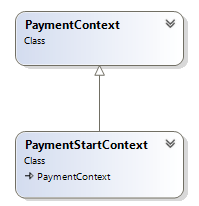
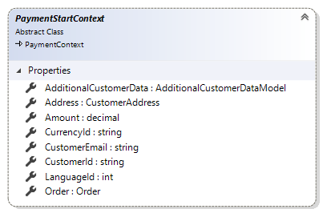

# PaymentStartContext reference

This article provides reference material about `PaymentStartContext` class.

`PaymentStartContext` is an extended version of `PaymentContext`. `PaymentStartContext`
class provides extension developers with additional information that is needed to start payment
process. It is available as a parameter in `StartPayment` method of payment extensions.

Sana automatically fill in `PaymentStartContext` parameter of `StartPayment` method
with data from order, transaction, shop context, etc.

Take into account that `PaymentStartContext` is inherited from `PaymentContext`, so that
you have access to the properties available in `PaymentContext`. More information about
`PaymentContext` you can find in [PaymentContext reference](payment-context.md) article.

## Properties

### AdditionalCustomerData

Gets the additional customer data for payment provider. This data has been collected on
"Information for payment provider" checkout step. More details about additional customer data
for payment provider you can find in
[Additional information for payment method during checkout](https://community.sana-commerce.com/docs/SCC_Guides/Extensions/how-to/additional-customer-data-model.html)
article.

### Address

Gets the customer address. This property contains customer billing address from the ERP.

### Amount

Gets the amount to be paid. This property contains the amount of the order from checkout
that is need to be paid.

### CurrencyId

Gets the currency identifier. This property contains identifier of currency that assigned
to customer in ERP.

### CustomerEmail

Gets the customer e-mail address. This property contains shop account email for registered
users or email entered on checkout for those who use guest checkout.

### CustomerId

Gets the customer identifier.

### LanguageId

Gets the language identifier. This property contains identifier of the language selected
by user on the web store.

### Order

Gets the order being paid. Can be `null` if the payment subject entity which is being paid
is not an order.

## See also

[Additional information for payment method during checkout](https://community.sana-commerce.com/docs/SCC_Guides/Extensions/how-to/additional-customer-data-model.html)