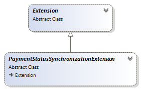
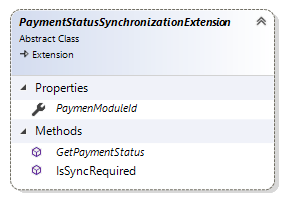

# PaymentStatusSynchronizationExtension reference

This article provides reference material about `PaymentStatusSynchronizationExtension` class.
All payment status synchronization extensions have to be inherited from this class which, in turn,
inherits from the core Sana `Extension` class.



## Properties



### PaymentModuleId

Gets or sets identifier of payment module.

Payment module identifier connects payment status synchronization extension with payment extension
itself. Therefore this identifier has to be the same as in [`PaymentModuleIdAttribute`](https://community.sana-commerce.com/docs/SCC_Guides/Extensions/how-to//create-payment-extension.md#PaymentModuleIdAttribute) 
of payment extension.

Payment status synchronization extension processes transactions of payment methods that use payment
provider with the corresponding payment module identifier. 
Payment status synchronization extension will be skipped if no payment extension with 
corresponding identifier exists.

```cs
public class CustomPayPalSynchronizationExtension : PaymentStatusSynchronizationExtension
{
    public override string PaymentModuleId => PaymentExtension.GetPaymentModuleId(typeof(CustomPayPalPaymentExtension));
}
```

## Methods

### GetPaymentStatus

Returns actual payment status.

This method is called for each payment transaction with status `PaymentStatus.InProgress`.
In this method you should implement logic of getting actual payment status of current payment
transaction from the payment service provider. This method has to return one of the payment
statuses available in the [PaymentStatus enum](payment-status.md).

```cs
public override PaymentStatus GetPaymentStatus(PaymentStatusSyncContext context)
{
    // Assuming that PspWebService is your instance of PSP gateway service
    var updatedStatus = PspWebService.GetPaymentStatus(context.TransactionId);

    switch (updatedStatus)
    {
        case "paid":
        case "captured":
            return PaymentStatus.Paid;
        case "cancelled":
        case "failed":
            return PaymentStatus.Cancelled:
    }
    return PaymentStatus.InProgress;
}
```

### IsSyncRequired

Returns boolean value indicating whether payment status synchronization is required for
payment method.

This method is called for each payment method that uses payment provider specified in
[PaymentModuleId](#paymentmoduleid) property.

This method gets parameter of `PaymentMethodContext` type, so that you can use this data to decide
whether payment status synchronization is needed for payment method.

```cs
public override bool IsSyncRequired(PaymentMethodContext paymentMethod)
{
    return (paymentMethod.MethodSettings as CustomPayPalSettings).IsDelayedCaptureEnabled;
}
```