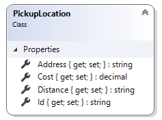

# PickupLocation reference

`PickupLocation` class represents an information about pickup location.

## Properties



### Id

The unique ID of pickup location.

### Address

The address of pickup location.

### Cost

The delivery cost.

### Distance

The user friendly formatted distance between customer address and pickup location.

**Value example:**
```
3.5 km
```

## See also

[Pickup locations](..\how-to\pickup-locations-for-shipping-extension.md)
