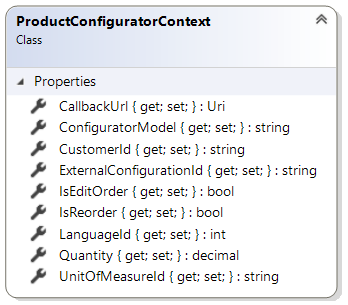

# ProductConfiguratorContext reference

This article provides reference material about `ProductConfiguratorContext` class.

`ProductConfiguratorContext` class is used during the process of specific product configuration
 to pass information from Sana to the configurator extension. It is available as a parameter in
`GetConfiguratorUrlAsync` method of product configurator extensions.

## Properties

### CallbackUrl

Gets or sets the callback URL to which the configurator service can post values back to Sana.

### ConfiguratorModel

Gets or sets the configurator model specific to currently configured product.

Product configurator may have a few different models to configure products. For example product
configuration result can be:
- pre-created (already existed) product item in ERP
- new product wich saves to ERP

This property contains the value that comes from configurator model field of product entity.

### ExternalConfigurationId

Gets or sets the identifier of current product configuration on configurator service's side.

This is the value that the external configurator service may generate and use as it's
ID for this particular configuration. Sana refers to it as a session ID on configurator
service's side. It can be used to edit existing product configuration that has been created
by a user some time before.

### IsEditOrder

Gets or sets a value indicating whether the current basket is created to edit order.
When the user edits existing order in Sana, this property will have `true` value.

When the user is editing existing order the `ExternalConfigurationId`
will contain an ID of already existing configuration in external configurator service,
because it had been created already previously. It is recommended that the configurator
extension creates a new product configuration when the user is editing existing order.

### IsReorder

Gets or sets a value indicating whether the current basket is created to re-order.
The user may choose to re-order existing sales order, in this case this property
will have `true` value.

Here the same rule applies as with `IsEditOrder` property.

When the user is re-ordering existing order the `ExternalConfigurationId`
will contain an ID of already existing configuration in external configurator service,
because it had been created already previously. It is recommended that the configurator
extension creates a new product configuration when the user is re-ordering existing order.

### CustomerId

Gets or sets the identifier of current customer browsing the web store.

### LanguageId

Gets or sets the identifier of the language selected by the user in the web store.

### Quantity

Gets or sets the quantity of the product being configured as selected by the user to pass
it from Sana to the configurator extension.

### UnitOfMeasureId

Gets or sets the unit of measure of the product being configured as selected by the user
to pass it from the Sana to the configurator extension.

## See also

[ProductConfiguratorExtension reference](product-configurator-extension.md)