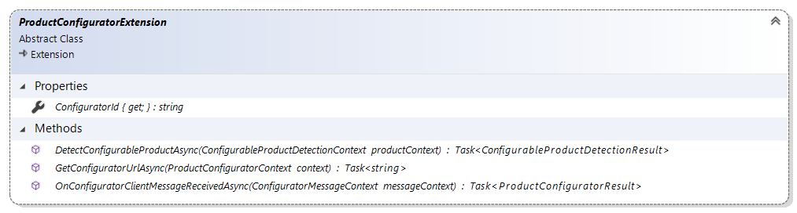

# ProductConfiguratorExtension reference

`Sana.Extensions.ProductConfigurator.ProductConfiguratorExtension` is an abstract class that you should implement
when you develop a new product configurator extension for Sana Commerce.



## Properties

### ConfigurationId

Gets the identifier of product configurator extension. The identifier should be unique among
all other product configurator extensions. Sana will remember which products were configured
by which product configurator extension using this property value.

```cs
public override string ConfiguratorId => "CustomProductConfigurator";
```

## Methods

<a id="DetectConfigurableProductAsync"></a>
### DetectConfigurableProductAsync

Detects whether specified product can be configured using this configurator extension.

Sana calls this method and passes the instance of [ConfigurableProductDetectionContext](configurable-product-detection-context.md)
with product information and the method returns an instance of [ConfigurableProductDetectionResult](configurable-product-detection-result.md)
which indicates whether specified product is recognized by current extension as configurable or not.

The method is called by Sana asynchronously, so you may use `async/await` here in case
you need to access any external resources in an asynchronous way.

Example:

```cs
public override Task<ConfigurableProductDetectionResult> DetectConfigurableProductAsync(ConfigurableProductDetectionContext productContext)
{
    bool isConfigurable = productContext.ConfiguratorModel != null && productContext.ConfiguratorModel.StartsWith("my-custom-configurator:");
    var result = isConfigurable
        ? ConfigurableProductDetectionResult.Success()
        : ConfigurableProductDetectionResult.Failure();
    return Task.FromResult(result);
}
```

<a id="GetConfiguratorUrlAsync"></a>
### GetConfiguratorUrlAsync

Gets the URL of the external product configurator web site which will be opened in an `iframe`.

Sana opens the configurator web site in the `iframe` on the web store's page. This method is used to
get the URL to open in the `iframe`.
Sana will call this method and pass the instance of [ProductConfiguratorContext](product-configurator-context.md)
with all the data needed to create the URL to the product configurator.

Example:

```cs
public override Task<string> GetConfiguratorUrlAsync(ProductConfiguratorContext context)
{
    var uri = new UriBuilder(Configuration.ConfiguratorUrl);
    var query = new QueryString("");
    query.Add("configuratorModel", context.ConfiguratorModel);
    query.Add("quantity"], context.Quantity.ToString());
    query.Add("unitOfMeasureId", context.UnitOfMeasureId);

    uri.Query = query.ToString();

    return Task.FromResult(uri.ToString());
}
```

The method is called by Sana asynchronously, so you may use `async/await` here in case
you need to access any external resources in an asynchronous way.

<a id="OnConfiguratorClientMessageReceivedAsync"></a>
### OnConfiguratorClientMessageReceivedAsync

Processes the message that Sana receives from the configurator web site via client browser
window when it is shown in the `iframe`.

Sana shows the `iframe` and keeps listening for any messages that the configurator web site shown in
the `iframe` might pass to the parent window. If such message is received it will be passed here to this
method and Sana expects this method to parse the message and return the actual product(s) that the user
has configured.

Sana calls this method and passes the instance of [ConfiguratorMessageContext](configurator-message-context.md)
with the message passed from the configurator web site and the method returns an instance of
[ProductConfiguratorResult](product-configurator-result.md)
which contains product(s) that is (are) the actual result of the configuration which
needs to be added to the shopping cart.

Example:

```cs
public override Task<ProductConfiguratorResult> OnConfiguratorClientMessageReceivedAsync(ConfiguratorMessageContext messageContext)
{
    var deserialized = JsonConvert.DeserializeObject<TestProductResult>(messageContext.MessageFromConfigurator);
    var product = new ConfiguredProduct()
    {
        ProductId = deserialized.SelectedProductId,
        VariantId = deserialized.SelectedVariantId,
        UnitOfMeasureId = deserialized.UnitOfMeasureId,
        Quantity = deserialized.Quantity,
        Description = deserialized.Description,
        ImageUrl = deserialized.ImageUrl
    };
    var result = new SingleProductConfiguratorResult(deserialized.SessionId, product);
    return Task.FromResult<ProductConfiguratorResult>(result);
}

internal class TestProductResult
{
    public string SessionId { get; set; }
    public string SelectedProductId { get; set; }
    public string SelectedVariantId { get; set; }
    public decimal? Quantity { get; set; }
    public string UnitOfMeasureId { get; set; }
    public string Description { get; set; }
    public string ImageUrl { get; set; }
}
```

The method is called by Sana asynchronously, so you may use `async/await` here in case
you need to access any external resources in an asynchronous way.

## See also

[Create product configurator extension](https://community.sana-commerce.com/docs/SCC_Guides/Extensions/how-to//create-product-configurator-extension.md)

[ConfiguratorMessageContext reference](configurable-product-detection-context.md)

[ProductConfiguratorResult reference](product-configurator-result.md)

[ConfigurableProductDetectionContext reference](configurable-product-detection-context.md)

[ConfigurableProductDetectionResult reference](configurable-product-detection-result.md)

[ProductConfiguratorContext reference](product-configurator-context.md)
