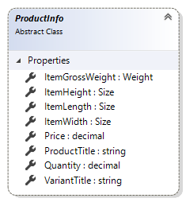

# ProductInfo reference

`ProductInfo` class represent an information about product.

## Properties

### ItemGrossWeight

Total gross weight of products in this line (gross weight of one item multiplied by the quantity of this line).

### ItemHeight

The height of a single item.

### ItemLength

The length of a single item.

### ItemWidth

The width of a single item.

### Price

The price of the variant or product including customer specific prices, line discounts and VAT.

### ProductTitle

The title of the product.

### Quantity

The quantity of products/variants ordered in this line.

### VariantTitle

The variant title of the product. It can be null when product without variants.

## See also

[ShippingContext reference](shipping-context.md)

[Weigh reference](weight.md)

[Size reference](size.md)