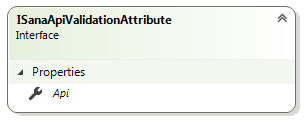

# ISanaApiValidationAttribute

This interface declares `Api` property which holds the instance of `SanaApi` type while validation and which is the entry point to core Sana Commerce Framework functionality.

You can find example of this interface usage in next article: [Using Sana texts in custom validation attributes](https://community.sana-commerce.com/docs/SCC_Guides/Extensions/how-to//sana-texts-in-validation-attributes.md)

## Properties



### Api

Gets the instance of the `SanaApi` type. See: [Extension.Api](extension-api.md).

```cs
var validationMessage = Api.GetSanaText("LastDigitsOfPhoneNumber_ValidationMessage", "The last digits of your phone are incorrect.");
```

## See also

[Using Sana texts in custom validation attributes](https://community.sana-commerce.com/docs/SCC_Guides/Extensions/how-to//sana-texts-in-validation-attributes.md)

[Extension.Api](extension-api.md)