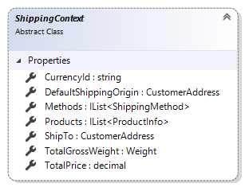

# ShippingContext reference

This article provides reference material about `ShippingContext` class.

`ShippingContext` class provides extension developers with information needed during
shipping costs calculation process. It is available as a parameter in
`FinalizePaymentCalculateShippingRates` method of shipping extensions.

Sana automatically fills in `ShippingContext` parameter with data from basket,
selected shipping address, etc.

## Properties



### CurrencyId

Gets the identifier of current user's currency.

Usually it is used by shipping service providers to calculate shipping costs in customer's
currency.

```cs
public override IList<ShippingRate> CalculateShippingRates(ShippingContext shippingContext)
{
    var calculateShippingCostRequest = new CalculateShippingCostsRequest();
    calculateShippingCostRequest.CurrencyId = shippingContext.CurrencyId;

    ...
}
```

### DefaultShippingOrigin

Gets the shipping origin.

Shipping origin is the address of shipper that will be used as a start point of shipping.

```cs
public override IList<ShippingRate> CalculateShippingRates(ShippingContext shippingContext)
{
    var calculateShippingCostRequest = new CalculateShippingCostsRequest();
    FillShippingOrigin(calculateShippingCostRequest, shippingContext);

    ...
}

private void FillShippingOrigin(CalculateShippingCostsRequest request, ShippingContext shippingContext)
{
    var shippingOrigin = shippingContext.DefaultShippingOrigin;
    request.Shipper = $"{shippingOrigin.LastName} {shippingOrigin.FirstName}";
    request.ShipFrom = $"{shippingOrigin.CountryName}, {shippingOrigin.City}, {shippingOrigin.Address}";
}
```

### Methods

Gets the collection of enabled and available shipping methods.

Extension developer should use this collection of shipping methods in order to calculate
shipping costs for each shipping method of this extension that will be shown to the user
during shopping cart checkout.

```cs
public override IList<ShippingCost> CalculateShippingRates(ShippingContext shippingContext)
{
    var calculatedRates = new List<ShippingCost>();
    foreach (var method in shippingContext.Methods)
    {
        var rate = new ShippingCost
        {
            Cost = /* calculate actual cost here */,
            ShippingMethodId = method.Id,
        };
        calculatedRates.Add(rate);
    }
    return calculatedRates;
}
```

### Products

Gets a collection of all products that need to be shipped.

This collection of product gives ability to extension developer to calculate product dimensions
considering all extension-specific calculation rules.

```cs
public override IList<ShippingRate> CalculateShippingRates(ShippingContext shippingContext)
{
    var calculateShippingCostRequest = new CalculateShippingCostsRequest();
    FillParcelDimensions(calculateShippingCostRequest, shippingContext);

    ...
}

private void FillShipToAddress(CalculateShippingCostsRequest request, ShippingContext shippingContext)
{
    request.TotalLength = shippingContext.Products.Sum(p => p.Quantity * p.ItemLength.Inches);
    request.TotalWidth = shippingContext.Products.Sum(p => p.Quantity * p.ItemWidth.Inches);
    request.TotalHeight = shippingContext.Products.Sum(p => p.Quantity * p.ItemHeight.Inches);
}
```

### ShipTo

Gets a destination address where products need to be shipped to.

```cs
public override IList<ShippingRate> CalculateShippingRates(ShippingContext shippingContext)
{
    var calculateShippingCostRequest = new CalculateShippingCostsRequest();
    FillShipToAddress(calculateShippingCostRequest, shippingContext);

    ...
}

private void FillShipToAddress(CalculateShippingCostsRequest request, ShippingContext shippingContext)
{
    var shipTo = shippingContext.ShipTo;
    request.Shipper = $"{shipTo.LastName} {shipTo.FirstName}";
    request.ShipFrom = $"{shipTo.CountryName}, {shipTo.City}, {shipTo.Address}";
}
```

### TotalGrossWeight

Gets the total gross weight of all products in the shopping cart.

```cs
public override IList<ShippingRate> CalculateShippingRates(ShippingContext shippingContext)
{
    var calculateShippingCostRequest = new CalculateShippingCostsRequest();
    calculateShippingCostRequest.Weight = shippingContext.TotalGrossWeight.Kilograms;

    ...
}
```

### TotalPrice

Gets the total price of all products including invoice discount and VAT.

## See also

[ShippingExtension reference](shipping-extension.md)

[ShippingRate reference](shipping-rate.md)