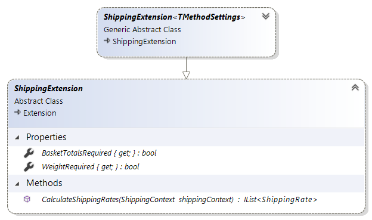

# ShippingExtension reference

`Sana.Extensions.Shipping.ShippingExtension` is an abstract class that you should implement
when you develop a new shipping provider extension for Sana Commerce.



## Properties

### BasketTotalsRequired

Gets the value indicating whether calculated basket totals are required to calculate shipping
rates in this extension. 

If your extension depends on correct basket total amounts, e.g. when shipping cost must be
zero when basket total amount is more than a certain number, implement this property and return
`true` to trigger necessary calculations in Sana:

```cs
public override bool BasketTotalsRequired => true;
```

Otherwise, if your extension does not depend on basket total amount, e.g. when shipping cost
depends only on weight of items in the basket, implement this property and return `false`
to avoid unnecessary calculations. In such cases basket totals that are available to your
extension through [ShippingContext](shipping-context.md) will be zero:

```cs
public override bool BasketTotalsRequired => false;
```

### WeightRequired

Gets the value indicating whether package weight is required to calculate shipping rates in
this extension.

If your extension depends on weight of items in the basket, implement this property and return
`true` to trigger necessary weight calculations in Sana:

```cs
public override bool WeightRequired => true;
```

Otherwise, if your extension does not depend on package weight, implement this property and
return `false` to avoid unnecessary weight calculations for items in the basket. In such case
weights of items that are available to your extension through [ShippingContext](shipping-context.md)
will be null:

```cs
public override bool WeightRequired => false;
```

## Methods

### CalculateShippingRates

Calculates shipping rates for specified shipping methods. 

Implement the actual logic of shipping rate calculation in this method. During checkout process
Sana will call this method, pass in the instance of [ShippingContext reference](shipping-context.md)
where all the data needed for your calculations will be available and you should return calculated
shipping rates as a result.

```cs
public override IList<ShippingCost> CalculateShippingRates(ShippingContext shippingContext)
{
    var calculatedRates = new List<ShippingCost>();
    foreach (var method in shippingContext.Methods)
    {
        var rate = new ShippingCost
        {
            Cost = /* calculate actual cost here */,
            ShippingMethodId = method.Id,
        };
        calculatedRates.Add(rate);
    }
    return calculatedRates;
}
```

## See also

[ShippingContext reference](shipping-context.md)