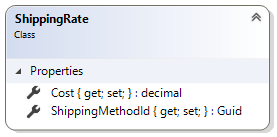

# ShippingRate reference

This article provides reference material about `ShippingRate` class. 

`ShippingRate` class represents relation between certain shipping method and
it's cost.

[Shipping extension](shipping-extension.md) has to return a collection of `ShippingRate` items
when Sana calls `CalculateShippingRates` method. This collection of shipping costs
will be shown to customer on corresponding checkout step.

## Properties



### Cost

Gets or sets shipping cost.

### ShippingMethodId

Gets or sets `Guid` identifier of shipping method.
This identifier can be found in `ShippingContext.Methods` collection that contains all
shipping methods that are available for customer.

```cs
public override IList<ShippingCost> CalculateShippingRates(ShippingContext shippingContext)
{
    var calculatedRates = new List<ShippingCost>();
    foreach (var method in shippingContext.Methods)
    {
        var rate = new ShippingCost
        {
            Cost = /* calculate actual cost here */,
            ShippingMethodId = method.Id,
        };
        calculatedRates.Add(rate);
    }
    return calculatedRates;
}
```

## See also

[ShippingContext reference](shipping-context.md)