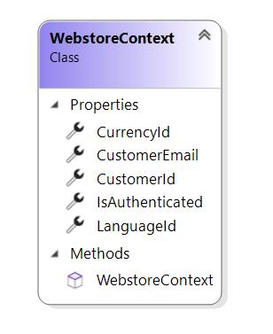

# WebstoreContext reference

This article provides reference material about `WebstoreContext` class.

`WebstoreContext` class incapsulates webstore-related information such as a customer identifier or a language used by an user.

## Properties

### CurrencyId

The currency identifier.

### LanguageId

The LCID of a language used by the user.

### CustomerId

The customer identifier.
Could be `null` if guest checkout is used but guest hasn't been saved to the ERP yet.

### CustomerEmail

The customer e-mail address.

### IsAuthenticated

Indicates whether the current user is authenticated.

## See also

[WebstoreEndpointExtension reference](webstore-endpoint-extension.md)

