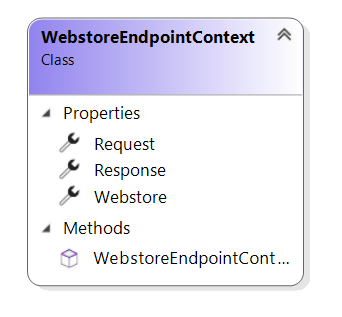

# WebstoreEndpointContext reference

This article provides reference material about `WebstoreEndpointContext` class.

`WebstoreEndpointContext` class provides extension developers with information needed during
webstore endpoint execution.

Sana automatically fills in `WebstoreEndpointContext` parameter with request, response and webstore contexts.

## Properties

### Request

The HTTP request.

### Response

The HTTP response.

### Webstore

The webstore-related context.

## See also

[WebstoreEndpointExtension reference](webstore-endpoint-extension.md)

