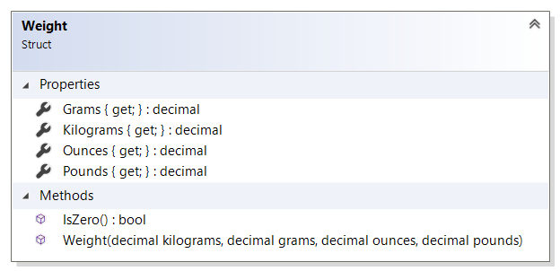

# Weight reference

`Weight` struct specifies weight of a product in multiple units of measure. For example,
a product entity has weight property and it is specified using `Weight` structure as data type.

All properties' values are precalculated by Sana so that in extension there is no need to
additionally convert weights between units of measure. For example, if a product has weight of
100 grams, then Sana will precalculate the weight values in all these units of measure:

* `Grams` will be `100`;
* `Kilograms` will be `0.1`;
* `Ounces` will be `3.52739619`;
* `Pounds` will be `0.220462262`.

Note that the values are not rounded up or down. Rounding, if needed, should be done
in the extension.

## Properties

### Grams

Gets the weight value in grams.

### Kilograms

Gets the same weight value in kilograms.

### Ounces

Gets the same weight value in ounces.

### Pounds

Gets the same weight value in pounds.

### IsZero

Checks whether the weight is zero.
Returns `true` if at least one of units of measure has zero value; 
`false` if all units of measure contain non-zero value.

## See also

[ProductInfo reference](product-info.md)