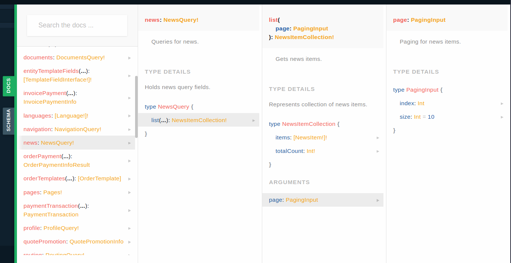
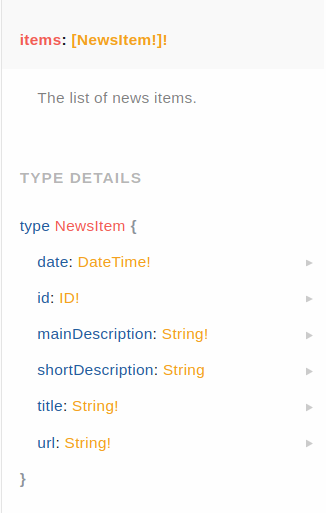
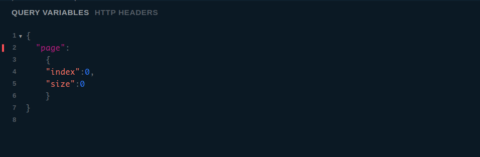
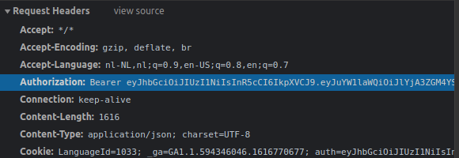

# GraphQL Introduction Article

>[!NOTE] In this article we will interact through the playground with an open Sana sandbox GraphAPI accessible to everyone. If you have Sana running on your computer you can test queries on the api through Sana's `/api/graph` endpoint using Altair GraphQL client.

This article will familiarize you with the Sana GraphQL implementation. It will cover some basic queries that can be dispatched to the GraphAPI.
Using the [GraphQL playground](playground.md) we will show you how to add the necessary authentication header so that you can successfully make requests that need authentication. We will also use the playground to add variables, to show how variables are used in some queries.

## Introduction to the playground

The playground hosted on this website is connected to a sandbox version of sana which allows for cross origin requests. Therefore, anyone can expirement with running queries and mutations. If you visit the playground you will be able to explore all the queries and mutations in the docs tab so that you can get a feel for the schema.

### A simple query

Now that we have an overview of the schema, we can construct a query with the types we see. On the news page of the webstore sana requests a list of news items from the GraphAPI. Let us try reconstruct the query used for getting that list. If we scroll through queries in the docs we can find the `NewsQuery` type.



We can write a query for the `NewsQuery` type by using its name "news". The `NewsQuery` holds a `NewsItemCollection` type, if we click on that type we can see that it holds a list of `NewsItem` type and that it holds a scalar integer type which tells us how many news items there is. In the same row we can see that the `NewsItemCollection` type takes an argument of `PagingInput` type, clicking on `PagingInput` tells us what this input type is made of (it lets you choose how many news items you want starting at a specific index). Finally, we want to see the `NewsItem` type so that we know the shape of the `NewsItem` and so that we can query specific fields.



As you can see `NewsItems` holds scalar types, on the webstore we need the short description and title of the news item.
Now that we know all the names of the types we can construct a query to get the data we want from the news items. We create a query and declare the variable $page of type `PagingInput`, from the docs we found all the type names so that we can query the information we want.

```graphql
query NewsItemsQuery($page: PagingInput){
    # Use GraphQL Query Variables to inject PagingInput
    news{
        list(page: $page){
         items{
            title
            shortDescription
          }
      }
    }
}
```

If you open the query in playground you can expirement by changing the `PagingInput` variable, like so.



### Mutations

Staying in the news items context, we now want to create a mutation (which is used in the admin client) to upload new news items to the database through the GraphAPI. Similarly, exploring the docs we come to this mutation.

```gql
mutation NewsItemsMutation($input: NewsPageInput!){
    pages{
        news{
        create(input:$input){
            id
        } 
    }
  }
}
```

If the id gets returned we know it was successful. Here are the query variables we used to test.

```json
{
    "input":
    {
        "title":"New News item",
        "url": "/newitem",
        "date": "2021-05-20T14:14:47.527Z",
        "mainDescription": "New news item about news",
        "shortDescription": "New news item about something"
    }
}
```

We can now re-run the `NewsItemsQuery` to see our news item get returned.

### Authorization

Now, we don't want everyone to be able to upload news items to the database, in sana every request you make holds an authorization header, this makes sure the user is authenticated for the action they are taking. In the playground we already give you an administrator authorization header for the sandbox, check for yourself. If you were to use for example Altair GraphQL client to inspect your own sana GraphAPI, you must still add a header. If you are logged in to sana as an administrator you can observe the necessary header by opening dev tools and going to the network tab. Here you can see which request headers are sent along your requests to sana. Look for the "Authorization" header.

>[!NOTE] `/api/graph` and `/admin/api/graph` take different authorization headers because they have different types of users.


